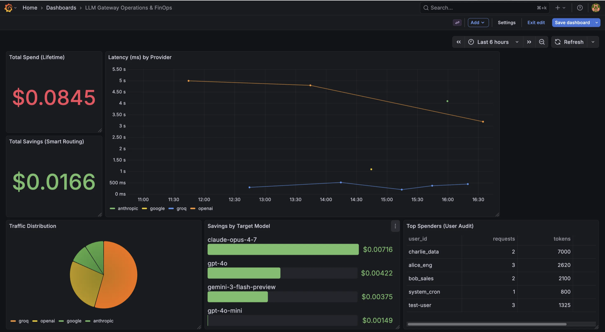

# LLM Gateway Handbook

Production-style Java/Spring Boot gateway that routes chat requests across multiple LLM providers, applies ACL-aware retrieval, logs token/cost/latency telemetry, and exposes operational controls for resiliency testing.

This handbook is focused on running and operating the current codebase as-is.

## What This Service Does

- Accepts chat completion requests through a single API endpoint.
- Routes requests to provider-specific clients (`openai`, `anthropic`, `google`, `groq`).
- Optionally downgrades simple queries to cheaper models for cost savings.
- Supports document ingestion and ACL-aware context retrieval via Postgres + `pgvector`.
- Persists request telemetry (`request_logs`) for Grafana FinOps dashboards.
- Uses Resilience4j circuit breakers and a global rate limiter.

## Current Architecture At A Glance

- **API Layer**
  - `POST /v1/chat/completions` (SSE streaming response)
  - `POST /api/documents/ingest`
  - Chaos endpoints under `/chaos/*` for circuit testing
- **Routing Layer**
  - `RouterService` performs model selection + fallback chain execution
  - `SmartRouterService` classifies query complexity (simple vs complex)
- **Provider Layer**
  - OpenAI, Groq, Anthropic, Gemini provider adapters
- **RAG Layer**
  - Embedding generation (`EmbeddingClient`)
  - ACL-filtered retrieval query using `allowed_groups && ?::text[]`
- **Persistence/Observability**
  - Postgres tables managed by JPA
  - Async request logging + cost calculation
  - Grafana dashboard backed by Postgres datasource

## Prerequisites

- Java 21
- Docker + Docker Compose
- One or more provider API keys:
  - `OPENAI_API_KEY`
  - `GROQ_API_KEY`
  - `GEMINI_API_KEY`
  - `CLAUDE_API_KEY`

## Local Setup (End-to-End)

### 1) Start infrastructure

```bash
docker compose up -d
```

This starts:
- Postgres (`localhost:5432`)
- Grafana (`localhost:3000`, admin/admin)
- pgAdmin (`localhost:5050`, admin@admin.com/admin)

### 2) Export API keys

```bash
export OPENAI_API_KEY="..."
export GROQ_API_KEY="..."
export GEMINI_API_KEY="..."
export CLAUDE_API_KEY="..."
```

If you only test a subset of providers, only those keys are strictly required.

### 3) Start the gateway

```bash
./mvnw spring-boot:run
```

Default app port: `8080`.

## Configuration Guide

Primary runtime config lives in `src/main/resources/application.yaml`.

- **Database**
  - `spring.datasource.url=jdbc:postgresql://localhost:5432/gateway_db`
  - Credentials default to `user/password`
- **Embeddings**
  - `gateway.embedding.provider` defaults to `ollama`
  - Ollama base URL is `http://localhost:11434`
- **Provider keys**
  - Loaded from env vars listed above
- **Model registry**
  - `gateway.models.*` defines provider, input/output costs, and fallback chain
- **Rate limit**
  - `resilience4j.ratelimiter.instances.gateway-api.limit-for-period=1`
  - Effective default: 1 request per minute (global limiter)

## API Handbook

### 1) Streaming chat completions

`POST /v1/chat/completions`

Headers:
- `Content-Type: application/json`
- `Authorization: Bearer <token>`

Note: `Authorization` is currently required by method signature but not validated.

Example request:

```bash
curl -N -X POST "http://localhost:8080/v1/chat/completions" \
  -H "Content-Type: application/json" \
  -H "Authorization: Bearer dev-token" \
  -d '{
    "model": "claude-opus-4-7",
    "messages": [
      {"role": "system", "content": "You are a helpful assistant"},
      {"role": "user", "content": "Summarize what this gateway does"}
    ],
    "temperature": 0.2,
    "stream": true,
    "metadata": {
      "user_id": "alice"
    }
  }'
```

### 2) Document ingestion

`POST /api/documents/ingest`

```bash
curl -X POST "http://localhost:8080/api/documents/ingest" \
  -H "Content-Type: application/json" \
  -d '{
    "content": "Quarterly financial policy for engineering",
    "allowedGroups": ["engineering", "finance"]
  }'
```

### 3) Chaos operations

- Open circuit for a provider:
  - `POST /chaos/break/{provider}`
- Close circuit:
  - `POST /chaos/fix/{provider}`
- List circuit states:
  - `GET /chaos/list`

Provider names typically include: `openai`, `groq`, `claude`, `gemini`.

## Verification Checklist

1. `docker compose ps` shows healthy Postgres/Grafana/pgAdmin.
2. Gateway starts without bean/config errors.
3. `POST /v1/chat/completions` returns streaming chunks.
4. Rows appear in `request_logs` after requests.
5. Grafana dashboard `LLM Gateway Operations & FinOps` renders data.

## Grafana Dashboard Snapshot



*Figure: Example Grafana view of LLM Gateway FinOps metrics, highlighting total spend, smart-routing savings, latency by provider, and traffic distribution.*

## Operations and Troubleshooting

- **429 responses immediately**
  - Rate limiter is configured to 1 request/minute. Raise `limit-for-period` for local testing.
- **Unknown provider/model errors**
  - Ensure request model exists in `gateway.models` and has valid `provider`.
- **No RAG context injected**
  - Include `metadata.user_id` and ensure matching `users` + `document_chunks` data exists.
- **Provider auth failures**
  - Verify env vars are exported in the same shell used to run the app.
- **Grafana empty panels**
  - Confirm gateway has written rows to `request_logs`.

## Known Codebase Notes (Important)

- This repo currently includes a few implementation mismatches to be aware of:
  - `DocumentChunk.embedding` column is `vector(1536)` while Ollama embedding client reports `768` dimensions.
  - `docker-compose.yml` does not run Ollama, although the default embedding provider is `ollama`.
  - `RequestLogService` currently stores a hardcoded user id (`test-user`).
  - Rate limit is intentionally strict for load protection and may feel restrictive in dev.

These do not prevent handbook usage, but they can affect behavior during deeper testing.

## Development Commands

- Run tests:
  - `./mvnw test`
- Build jar:
  - `./mvnw clean package`
- Run app:
  - `./mvnw spring-boot:run`

## Suggested Next Improvements

- Add an `.env.example` with all required keys.
- Add Docker service for Ollama or switch default embedding provider to OpenAI.
- Expose Actuator endpoints explicitly if Prometheus scraping is needed.
- Add request authentication/authorization enforcement for `Authorization` header.
